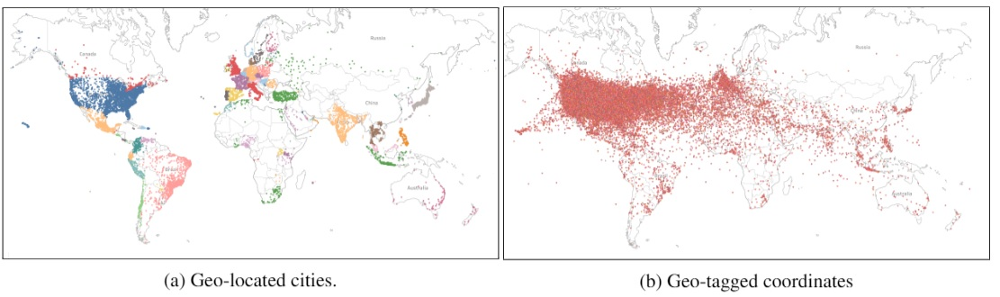
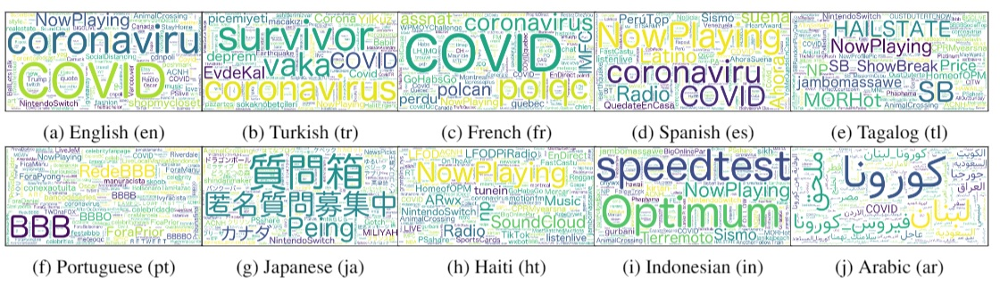

# Mega-COV
A billion-scale dataset from Twitter for studying COVID-19. The dataset is diverse (covers 234 countries), longitudinal (goes as back as 2007), multilingual (comes in 65 languages), and has a significant number of location-tagged tweets (~32M tweets). We release tweet IDs from the dataset, hoping it will be useful for studying various phenomena related to the ongoing pandemic and accelerating viable solutions to associated problems.

# World map coverage of Mega-COV *V0.1*

**(a) Left: Cities.** Each dot is a city. Contiguous cities of the same color belong to the same country. **(b) Right: Point co-ordinates**. Each dot is a point co-ordinate (longitude and Latitude) from which at least one tweet was posted.

# Word clouds for hashtags of Mega-COV *V0.1*
Word clouds for hashtags in tweets from the top 10 languages in the data. We note that tweets in non-English can still carry English hashtags or employ Latin script.


# Data Organization
The **Mega-COV** *V0.1* are organized as follows:
- Contains 566M tweet IDs
- you can donwload the *MegaCOV_v0.1.tar.gz* from [Google Drive](https://drive.google.com/drive/folders/1t3xZVi7iRBLJWm3xkXTZj-JDGD_opr55?usp=sharing)

# Ethical Considerations
We collect **Mega-COV** from the public domain (Twitter). In compliance with Twitter policy, we do not publish hydrated tweet content. Rather, we only publish publicly available tweet IDs. All Twitter policies, including respect and protection of user privacy, apply. We encourage all researchers who decide to use **Mega-COV** to review Twitter policy at [Twitter policy](https://developer.twitter.com/en/developer-terms/policy) before they start working with the data. 

# Contact US & Inquiries
- If you have any further questions about this dataset please contact Dr. Muhammad Abdul-Mageed at *emuhammad.mageeed[at]ubc[dot]ca*.

# Citation
```
@inproceedings{AbdulMageed2020MegaCOVAB,
  title={Mega-COV: A Billion-Scale Dataset of 65 Languages For COVID-19},
  author={Muhammad Abdul-Mageed and AbdelRahim Elmadany and Dinesh Pabbi and Kunal Verma and Rannie Lin},
  year={2020}
}
```
