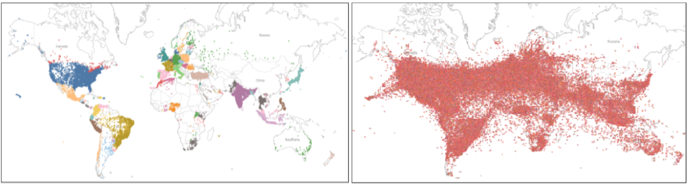
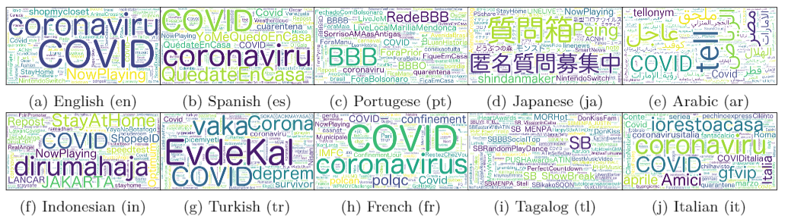
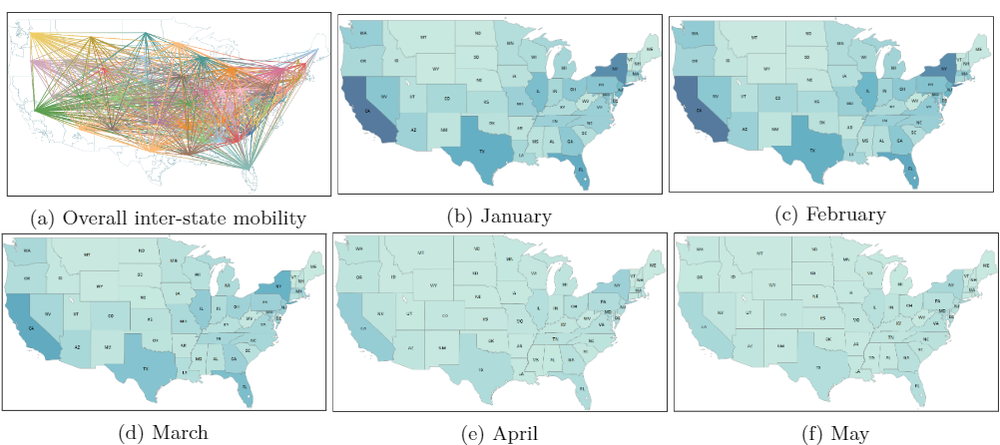

# Mega-COV
This repository includes information about *Mega-COV*, the dataset introduced in a recent paper ([Mega-COV: A Billion-Scale Dataset of 65 Languages For COVID-19](https://arxiv.org/abs/2005.06012)) we published on ArXiv. Mega-COV is a billion-scale dataset from Twitter for studying COVID-19. The dataset is diverse (covers 234 countries), longitudinal (goes as back as 2007), multilingual (comes in 65 languages), and has a significant number of location-tagged tweets (~32M tweets). We release tweet IDs from the dataset, hoping it will be useful for studying various phenomena related to the ongoing pandemic and accelerating viable solutions to associated problems.

---

# World map coverage of Mega-COV
 
**(a) Left: Cities.** Each dot is a city. Contiguous cities of the same color belong to the same country. **(b) Right: Point co-ordinates**. Each dot is a point co-ordinate (longitude and Latitude) from which at least one tweet was posted.

---

# Word clouds for hashtags of Mega-COV
Word clouds for hashtags in tweets from the top 10 languages in the data. We note that tweets in non-English can still carry English hashtags or employ Latin script.


---
# Inter-state user mobility in the U.S. for Jan.-May, 2020


# Download the Data

## Data Usage Agreement
- **Mega-COV** is licensed under the Creative Commons Attribution-NonCommercial-ShareAlike 4.0 International Public License ([CC BY-NC-SA 4.0](https://creativecommons.org/licenses/by-nc-sa/4.0/)). By using the dataset, you agree to abide by the stipulations in the license, remain in compliance with Twitter’s [Terms of Service](https://developer.twitter.com/en/developer-terms/agreement-and-policy), and cite the related paper ([Mega-COV: A Billion-Scale Dataset of 65 Languages For COVID-19](https://arxiv.org/abs/2005.06012)). (Please see citation section in the end of this README).

## Download
data orgnization and download files [link](https://github.com/UBC-NLP/megacov/tree/master/tweet_ids)

# Ethical Considerations
We collect **Mega-COV** from the public domain (Twitter). In compliance with Twitter policy, we do not publish hydrated tweet content. Rather, we only publish publicly available tweet IDs. All Twitter policies, including respect and protection of user privacy, apply. We encourage all researchers who decide to use **Mega-COV** to review Twitter policy at [Twitter policy](https://developer.twitter.com/en/developer-terms/agreement-and-policy) before they start working with the data. For example, Twitter provides the following policy around use of [sensitive information](https://developer.twitter.com/en/developer-terms/more-on-restricted-use-cases): 


## Sensitive information

You should be careful about using Twitter data to derive or infer potentially sensitive characteristics about Twitter users. Never derive or infer, or store derived or inferred, information about a Twitter user’s:

- Health (including pregnancy)
- Negative financial status or condition
- Political affiliation or beliefs
- Racial or ethnic origin
- Religious or philosophical affiliation or beliefs
- Sex life or sexual orientation
- Trade union membership
- Alleged or actual commission of a crime
- Aggregate analysis of Twitter content that does not store any personal data (for example, user IDs, usernames, and other identifiers) is permitted, provided that the analysis also complies with applicable laws and all parts of the Developer Agreement and Policy.

---

# Inquiries?
- If you have any questions about this dataset please contact us @ *muhammad.mageed[at]ubc[dot]ca*.

---
# Citation
```
@inproceedings{mageed2020MegaCOV,
  title={Mega-COV: A Billion-Scale Dataset of 65 Languages For COVID-19},
  author={Muhammad Abdul-Mageed and AbdelRahim Elmadany and Dinesh Pabbi and Kunal Verma and Rannie Lin},
  journal={arXiv preprint arXiv:2005.06012},
  year={2020}
}
```
